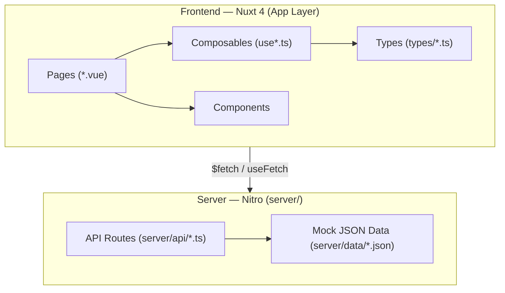
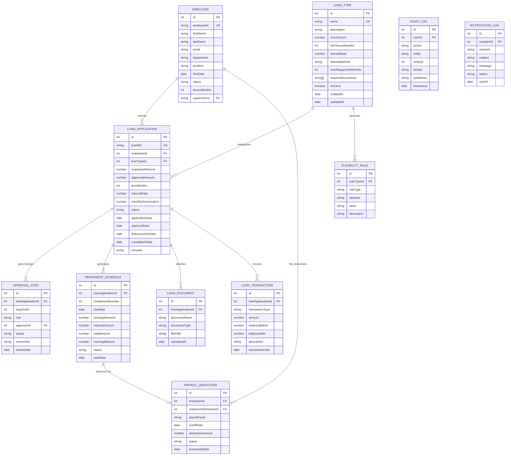
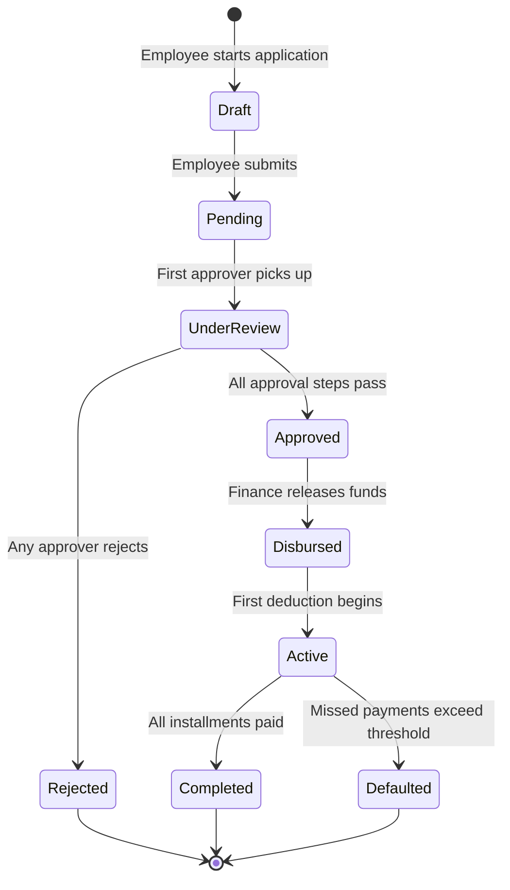
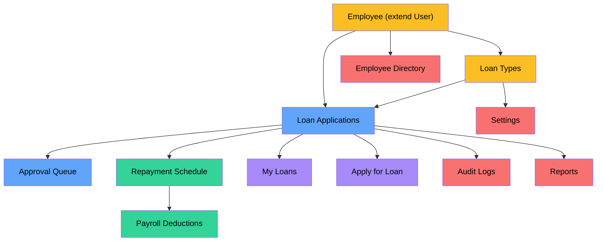

# Loan Management Platform — Architecture, Relationships & Schema

> Single source of truth for data modeling, entity relationships, and schema contracts.
> Use this document as a guideline when building pages, composables, API endpoints, and mock data.

Derived from [DEVDOCS.md](file:///Users/lnaguit/Desktop/code/loan-management-platform/DEVDOCS.md) and [PAGELIST.md](file:///Users/lnaguit/Desktop/code/loan-management-platform/PAGELIST.md).

---

## System Architecture Overview



---

## Entity Relationship Diagram



---

## Data Entities — Full Schema Reference

### 1. Employee

> **Extends**: The existing `User` type from [index.ts](file:///Users/lnaguit/Desktop/code/loan-management-platform/app/types/index.ts).
> **Used by**: Employee Directory, Loan Applications, Approval Queue, Payroll, My Loans.

| Field | Type | Required | Description |
|-------|------|----------|-------------|
| `id` | `number` | ✅ | Primary key (auto-increment) |
| `employeeId` | `string` | ✅ | Human-readable employee code (e.g., `EMP-0042`) |
| `firstName` | `string` | ✅ | First name |
| `lastName` | `string` | ✅ | Last name |
| `email` | `string` | ✅ | Company email (unique) |
| `department` | `string` | ✅ | e.g., Engineering, HR, Finance |
| `position` | `string` | ✅ | Job title |
| `hireDate` | `string` (ISO date) | ✅ | Employment start date |
| `status` | `'Active' \| 'Inactive' \| 'On Leave' \| 'Terminated'` | ✅ | Employment status |
| `tenureMonths` | `number` | — | Computed from `hireDate` |
| `role` | `'Employee' \| 'Supervisor' \| 'HR' \| 'Finance' \| 'Payroll' \| 'Admin'` | ✅ | System role (RBAC) |
| `supervisorId` | `number \| null` | — | FK → Employee (direct report) |
| `avatar` | `string \| null` | — | Profile image URL |

---

### 2. LoanType

> **Used by**: Loan Types page, Loan Application form (dropdown), Dashboard charts.
> **Existing partial**: [dashboard.ts → LoanType](file:///Users/lnaguit/Desktop/code/loan-management-platform/app/types/dashboard.ts#L15-L22)

| Field | Type | Required | Description |
|-------|------|----------|-------------|
| `id` | `number` | ✅ | Primary key |
| `name` | `string` | ✅ | Unique name (Salary Loan, Emergency Loan, etc.) |
| `description` | `string` | — | Purpose / policy summary |
| `maxAmount` | `number` | ✅ | Maximum loanable amount |
| `minTenureMonths` | `number` | ✅ | Minimum employment tenure required |
| `interestRate` | `number` | ✅ | Annual rate (%) — `0` for interest-free |
| `interestMethod` | `'flat' \| 'diminishing' \| 'fixed'` | ✅ | Computation method |
| `maxRepaymentMonths` | `number` | ✅ | Maximum term in months |
| `requiredDocuments` | `string[]` | — | e.g., `['Valid ID', 'Payslip']` |
| `isActive` | `boolean` | ✅ | Enable/disable toggle |
| `activeLoans` | `number` | — | Computed: current active loan count |
| `totalDisbursed` | `number` | — | Computed: cumulative disbursement |
| `createdAt` | `string` (ISO) | ✅ | Record creation timestamp |
| `updatedAt` | `string` (ISO) | ✅ | Last modification timestamp |

---

### 3. LoanApplication

> **Central entity** — nearly every page references this.
> **Existing partial**: [dashboard.ts → LoanApplication](file:///Users/lnaguit/Desktop/code/loan-management-platform/app/types/dashboard.ts#L5-L13)

| Field | Type | Required | Description |
|-------|------|----------|-------------|
| `id` | `number` | ✅ | Primary key |
| `loanRef` | `string` | ✅ | Unique reference (e.g., `LN-2026-001`) |
| `employeeId` | `number` | ✅ | FK → Employee |
| `employeeName` | `string` | ✅ | Denormalized for display |
| `loanTypeId` | `number` | ✅ | FK → LoanType |
| `loanType` | `string` | ✅ | Denormalized for display |
| `requestedAmount` | `number` | ✅ | Amount the employee requested |
| `approvedAmount` | `number \| null` | — | Final approved amount (may differ) |
| `termMonths` | `number` | ✅ | Repayment duration |
| `interestRate` | `number` | ✅ | Snapshot of rate at application time |
| `monthlyAmortization` | `number \| null` | — | Computed after approval |
| `status` | `LoanStatus` | ✅ | See status enum below |
| `applicationDate` | `string` (ISO) | ✅ | Submission date |
| `approvalDate` | `string \| null` | — | Date fully approved |
| `disbursementDate` | `string \| null` | — | Date funds released |
| `completionDate` | `string \| null` | — | Date loan fully repaid |
| `remarks` | `string \| null` | — | Approver notes |

#### Loan Status Enum

```
Draft → Pending → Under Review → Approved → Disbursed → Active → Completed
                                ↘ Rejected
                                         Active → Defaulted
```

```typescript
type LoanStatus =
  | 'Draft'
  | 'Pending'
  | 'Under Review'
  | 'Approved'
  | 'Rejected'
  | 'Disbursed'
  | 'Active'
  | 'Completed'
  | 'Defaulted'
```

---

### 4. ApprovalStep

> **Used by**: Approval Queue, Loan Application detail view.

| Field | Type | Required | Description |
|-------|------|----------|-------------|
| `id` | `number` | ✅ | Primary key |
| `loanApplicationId` | `number` | ✅ | FK → LoanApplication |
| `stepOrder` | `number` | ✅ | Sequence position (1, 2, 3…) |
| `role` | `'Supervisor' \| 'HR' \| 'Finance' \| 'Payroll'` | ✅ | Which role handles this step |
| `approverId` | `number \| null` | — | FK → Employee (assigned approver) |
| `status` | `'Pending' \| 'Approved' \| 'Rejected' \| 'Skipped'` | ✅ | Step outcome |
| `comments` | `string \| null` | — | Approver comments |
| `actionDate` | `string \| null` | — | When action was taken |

#### Default Approval Flow


---

### 5. RepaymentSchedule

> **Used by**: Repayment Tracker, My Loans detail, Loan Application detail.

| Field | Type | Required | Description |
|-------|------|----------|-------------|
| `id` | `number` | ✅ | Primary key |
| `loanApplicationId` | `number` | ✅ | FK → LoanApplication |
| `installmentNumber` | `number` | ✅ | e.g., 1 of 12 |
| `dueDate` | `string` (ISO) | ✅ | Scheduled payment date |
| `principalAmount` | `number` | ✅ | Principal portion |
| `interestAmount` | `number` | ✅ | Interest portion |
| `totalAmount` | `number` | ✅ | `principal + interest` |
| `runningBalance` | `number` | ✅ | Remaining balance after this installment |
| `status` | `'Scheduled' \| 'Paid' \| 'Overdue' \| 'Partially Paid' \| 'Waived'` | ✅ | Payment status |
| `paidDate` | `string \| null` | — | Actual payment date |

---

### 6. PayrollDeduction

> **Used by**: Payroll Deductions page, Repayment Tracker.

| Field | Type | Required | Description |
|-------|------|----------|-------------|
| `id` | `number` | ✅ | Primary key |
| `employeeId` | `number` | ✅ | FK → Employee |
| `employeeName` | `string` | ✅ | Denormalized |
| `loanRef` | `string` | ✅ | FK → LoanApplication.loanRef |
| `repaymentScheduleId` | `number` | ✅ | FK → RepaymentSchedule |
| `payrollCycle` | `string` | ✅ | e.g., `2026-06-A` (1st cutoff), `2026-06-B` (2nd cutoff) |
| `cutoffDate` | `string` (ISO) | ✅ | Cutoff date for this cycle |
| `deductionAmount` | `number` | ✅ | Amount to deduct |
| `status` | `'Scheduled' \| 'Processed' \| 'On-Hold' \| 'Cancelled' \| 'Adjusted'` | ✅ | Deduction status |
| `processedDate` | `string \| null` | — | When payroll ran this deduction |

---

### 7. LoanDocument

> **Used by**: Loan Application form (upload), Application detail view.

| Field | Type | Required | Description |
|-------|------|----------|-------------|
| `id` | `number` | ✅ | Primary key |
| `loanApplicationId` | `number` | ✅ | FK → LoanApplication |
| `documentName` | `string` | ✅ | Display name |
| `documentType` | `string` | ✅ | e.g., `Valid ID`, `Payslip`, `COE` |
| `filePath` | `string` | ✅ | Storage path / URL |
| `uploadedAt` | `string` (ISO) | ✅ | Upload timestamp |

---

### 8. LoanTransaction (Ledger)

> **Used by**: Repayment Tracker detail, Audit Logs, Reports.

| Field | Type | Required | Description |
|-------|------|----------|-------------|
| `id` | `number` | ✅ | Primary key |
| `loanApplicationId` | `number` | ✅ | FK → LoanApplication |
| `transactionType` | `'Disbursement' \| 'Repayment' \| 'Adjustment' \| 'Penalty' \| 'Waiver' \| 'Settlement'` | ✅ | Type of financial event |
| `amount` | `number` | ✅ | Transaction amount |
| `balanceBefore` | `number` | ✅ | Balance prior to transaction |
| `balanceAfter` | `number` | ✅ | Balance after transaction |
| `description` | `string \| null` | — | Human-readable note |
| `transactionDate` | `string` (ISO) | ✅ | When it occurred |

---

### 9. EligibilityRule

> **Used by**: Loan Types config, Application validation engine.

| Field | Type | Required | Description |
|-------|------|----------|-------------|
| `id` | `number` | ✅ | Primary key |
| `loanTypeId` | `number` | ✅ | FK → LoanType |
| `ruleType` | `'tenure' \| 'status' \| 'existing_loans' \| 'net_pay' \| 'department'` | ✅ | What the rule checks |
| `operator` | `'gte' \| 'lte' \| 'eq' \| 'neq' \| 'in' \| 'not_in'` | ✅ | Comparison operator |
| `value` | `string` | ✅ | Threshold value (parsed by rule engine) |
| `description` | `string` | — | Human-readable label |

---

### 10. AuditLog

> **Used by**: Audit Logs page, cross-cutting concern.

| Field | Type | Required | Description |
|-------|------|----------|-------------|
| `id` | `number` | ✅ | Primary key |
| `userId` | `number` | ✅ | FK → Employee (actor) |
| `userName` | `string` | ✅ | Denormalized |
| `action` | `string` | ✅ | e.g., `loan.created`, `approval.approved`, `payroll.processed` |
| `entity` | `string` | ✅ | Target entity type (e.g., `LoanApplication`) |
| `entityId` | `number` | ✅ | Target entity PK |
| `details` | `string \| null` | — | JSON or text with additional context |
| `ipAddress` | `string \| null` | — | Client IP |
| `timestamp` | `string` (ISO) | ✅ | When it happened |

---

### 11. NotificationLog

> **Used by**: Cross-cutting (via `useAppToast()`), no dedicated page.

| Field | Type | Required | Description |
|-------|------|----------|-------------|
| `id` | `number` | ✅ | Primary key |
| `recipientId` | `number` | ✅ | FK → Employee |
| `channel` | `'in-app' \| 'email' \| 'sms'` | ✅ | Delivery channel |
| `subject` | `string` | ✅ | Notification title |
| `message` | `string` | ✅ | Body text |
| `status` | `'Sent' \| 'Read' \| 'Failed'` | ✅ | Delivery status |
| `sentAt` | `string` (ISO) | ✅ | Timestamp |

---

### 12. DashboardData (Composite DTO)

> **Used by**: Dashboard page exclusively.
> **Source file**: [dashboard.ts](file:///Users/lnaguit/Desktop/code/loan-management-platform/app/types/dashboard.ts)
> **Composable**: [useLoanDashboard.ts](file:///Users/lnaguit/Desktop/code/loan-management-platform/app/composables/useLoanDashboard.ts)
> **Mock data**: [dashboard.json](file:///Users/lnaguit/Desktop/code/loan-management-platform/server/data/dashboard.json)

The dashboard consumes a **single aggregate object** (`DashboardData`) rather than individual entity endpoints. It uses lightweight DTOs with simplified field names compared to the full domain entities.

#### DashboardData — Root Shape

| Field | Type | Description |
|-------|------|-------------|
| `stats` | `DashboardStats` | KPI summary cards |
| `recentApplications` | `LoanApplication[]` (dashboard DTO) | Latest loan applications |
| `loanTypes` | `LoanType[]` (dashboard DTO) | Loan product overview |
| `repayments` | `RepaymentRecord[]` | Active repayment progress |
| `monthlyDisbursements` | `{ month: string; amount: number }[]` | Chart: disbursements over 6 months |
| `monthlyCollections` | `{ month: string; amount: number }[]` | Chart: collections over 6 months |
| `loansByStatus` | `{ status: string; count: number }[]` | Chart: doughnut by status |
| `loansByType` | `{ type: string; count: number }[]` | Chart: bar by loan type |

#### DashboardStats

| Field | Type | Stat Card Title | Icon |
|-------|------|----------------|------|
| `totalActiveLoans` | `number` | Active Loans | `i-lucide-file-check` |
| `pendingApprovals` | `number` | Pending Approvals | `i-lucide-clock` |
| `monthlyCollections` | `number` | Monthly Collections | `i-lucide-banknote` |
| `totalOutstanding` | `number` | Outstanding Balance | `i-lucide-wallet` |
| `totalDisbursed` | `number` | Total Disbursed | `i-lucide-trending-up` |
| `collectionRate` | `number` | Collection Rate (%) | `i-lucide-target` |

#### Dashboard LoanApplication DTO vs Full Entity

| Dashboard DTO Field | Type | Maps to Full Entity Field |
|---------------------|------|--------------------------|
| `id` | `number` | `id` |
| `employeeName` | `string` | `employeeName` |
| `loanType` | `string` | `loanType` |
| `amount` | `number` | `requestedAmount` |
| `status` | `'Draft' \| 'Pending' \| 'Approved' \| 'Rejected' \| 'Disbursed'` | `status` (subset of `LoanStatus`) |
| `date` | `string` | `applicationDate` |
| `term` | `number` | `termMonths` |

#### Dashboard LoanType DTO vs Full Entity

| Dashboard DTO Field | Type | Maps to Full Entity Field |
|---------------------|------|--------------------------|
| `id` | `number` | `id` |
| `name` | `string` | `name` |
| `maxAmount` | `number` | `maxAmount` |
| `interestRate` | `number` | `interestRate` |
| `activeLoans` | `number` | `activeLoans` (computed) |
| `totalDisbursed` | `number` | `totalDisbursed` (computed) |

#### RepaymentRecord (Dashboard-only)

| Field | Type | Description |
|-------|------|-------------|
| `id` | `number` | Primary key |
| `employeeName` | `string` | Employee display name |
| `loanRef` | `string` | Loan reference code |
| `loanType` | `string` | Loan type name |
| `outstandingBalance` | `number` | Remaining balance |
| `totalPaid` | `number` | Total amount paid so far |
| `nextDeduction` | `string` | Next deduction date |
| `progressPercent` | `number` | Repayment progress (0–100) |

> [!IMPORTANT]
> The dashboard DTOs are **read-only display projections**. They intentionally use shorter field names (`amount` instead of `requestedAmount`, `date` instead of `applicationDate`) for template brevity. When building full CRUD pages, use the complete entity types (§3, §2, §5) and transform to dashboard DTOs only when populating the dashboard aggregate.

---

## Entity → Page Mapping

Shows which entities are consumed by each page, guiding composable and API design.

| Page | Primary Entity | Related Entities | Composable | API Endpoint |
|------|---------------|------------------|------------|--------------|
| Dashboard | `DashboardData` | All (aggregated) | `useLoanDashboard()` ✅ | `GET /api/dashboard` ✅ |
| Loan Types | `LoanType` | `EligibilityRule` | `useLoanTypes()` | `GET/POST/PUT /api/loan-types` |
| Loan Applications | `LoanApplication` | `Employee`, `LoanType`, `LoanDocument`, `ApprovalStep` | `useLoanApplications()` | `GET/POST/PUT /api/loan-applications` |
| Repayment Tracker | `RepaymentSchedule` | `LoanApplication`, `LoanTransaction` | `useRepayments()` | `GET /api/repayments` |
| Approval Queue | `ApprovalStep` | `LoanApplication`, `Employee` | `useApprovals()` | `GET/PUT /api/approvals` |
| Payroll Deductions | `PayrollDeduction` | `Employee`, `RepaymentSchedule` | `usePayrollDeductions()` | `GET/PUT /api/payroll` |
| My Loans | `LoanApplication` | `RepaymentSchedule`, `LoanTransaction` | `useMyLoans()` | `GET /api/my-loans` |
| Apply for Loan | `LoanApplication` | `LoanType`, `EligibilityRule`, `LoanDocument` | `useLoanApplication()` | `POST /api/loan-applications` |
| Employee Directory | `Employee` | — | `useEmployees()` | `GET/POST/PUT /api/employees` |
| Audit Logs | `AuditLog` | `Employee` | `useAuditLogs()` | `GET /api/audit-logs` |
| Settings | Config objects | `LoanType`, `EligibilityRule` | `useSettings()` | `GET/PUT /api/settings` |
| Reports | Aggregated data | All | `useReports()` | `GET /api/reports` |

> ✅ = Already implemented

---

## Data Flow — Loan Lifecycle



---

## Relationship Summary

```
Employee ──┬── submits ──→ LoanApplication ──┬── categorized by ──→ LoanType ──── has ──→ EligibilityRule
            │                                  ├── goes through ────→ ApprovalStep
            │                                  ├── generates ───────→ RepaymentSchedule ──→ PayrollDeduction
            │                                  ├── attaches ────────→ LoanDocument
            │                                  └── records ─────────→ LoanTransaction
            │
            ├── receives ─→ NotificationLog
            └── tracked in → AuditLog
```

---

## Mock Data File Mapping

Each entity maps to a JSON file under `server/data/` for local development.

| Entity | JSON File | API Route | Status |
|--------|-----------|-----------|--------|
| Employee | `users.json` | `GET /api/users` | ✅ Exists |
| DashboardData | `dashboard.json` | `GET /api/dashboard` | ✅ Exists |
| LoanType | `loan-types.json` | `GET /api/loan-types` | 🔲 To create |
| LoanApplication | `loan-applications.json` | `GET /api/loan-applications` | 🔲 To create |
| ApprovalStep | `approvals.json` | `GET /api/approvals` | 🔲 To create |
| RepaymentSchedule | `repayments.json` | `GET /api/repayments` | 🔲 To create |
| PayrollDeduction | `payroll-deductions.json` | `GET /api/payroll` | 🔲 To create |
| LoanDocument | (embedded in loan apps) | — | 🔲 |
| LoanTransaction | `loan-transactions.json` | `GET /api/loan-transactions` | 🔲 To create |
| EligibilityRule | (embedded in loan types) | — | 🔲 |
| AuditLog | `audit-logs.json` | `GET /api/audit-logs` | 🔲 To create |
| Settings | `settings.json` | `GET /api/settings` | 🔲 To create |

> [!NOTE]
> `LoanDocument` and `EligibilityRule` are stored as nested arrays within their parent entities rather than as standalone files, since they are always fetched in context.

---

## TypeScript Type File Strategy

All types are organized under `app/types/`:

| File | Contains | Status |
|------|----------|--------|
| [index.ts](file:///Users/lnaguit/Desktop/code/loan-management-platform/app/types/index.ts) | `User`, `HeaderAction`, `AppLog` | ✅ Exists |
| [dashboard.ts](file:///Users/lnaguit/Desktop/code/loan-management-platform/app/types/dashboard.ts) | `DashboardData`, `DashboardStats`, `LoanApplication` (partial), `LoanType` (partial), `RepaymentRecord` | ✅ Exists |
| `employee.ts` | `Employee` (full), `EmployeeRole` | 🔲 To create |
| `loan-type.ts` | `LoanType` (full), `EligibilityRule`, `InterestMethod` | 🔲 To create |
| `loan-application.ts` | `LoanApplication` (full), `LoanStatus`, `LoanDocument` | 🔲 To create |
| `approval.ts` | `ApprovalStep`, `ApprovalStatus`, `ApprovalRole` | 🔲 To create |
| `repayment.ts` | `RepaymentSchedule`, `RepaymentStatus` | 🔲 To create |
| `payroll.ts` | `PayrollDeduction`, `PayrollCycle`, `DeductionStatus` | 🔲 To create |
| `transaction.ts` | `LoanTransaction`, `TransactionType` | 🔲 To create |
| `audit.ts` | `AuditLog`, `AuditAction` | 🔲 To create |
| `settings.ts` | `AppSettings`, `WorkflowConfig`, `PayrollConfig` | 🔲 To create |

> [!IMPORTANT]
> The partial types in `dashboard.ts` are **read-only display types** used by the dashboard. When building the full CRUD pages, create the complete types in their dedicated files and import them. The dashboard types can later reference the full types or remain as lightweight DTOs.

---

## Composable Architecture Pattern

Every page follows the same composable pattern established by `useUsers()`:

```
useLoanTypes()
├── State:       useState<LoanType[]>('loan-types', () => [])
├── Fetch:       fetchLoanTypes()  → $fetch('/api/loan-types')
├── Create:      createLoanType(data)
├── Update:      updateLoanType(id, data)
├── Delete:      deleteLoanType(id)
├── Seed:        seedLoanTypes()   → useDemoSeeder pattern
└── Logging:     useLogger()       → tracks all mutations
```

---

## Role-Based Access Control (RBAC) Matrix

| Feature | Employee | Supervisor | HR | Finance | Payroll | Admin |
|---------|----------|------------|-----|---------|---------|-------|
| Dashboard | View own | View team | ✅ Full | ✅ Full | ✅ Full | ✅ Full |
| Loan Types | View | View | ✅ CRUD | View | View | ✅ CRUD |
| Loan Applications | Own only | Team only | ✅ All | ✅ All | View | ✅ All |
| Approval Queue | — | ✅ Step 1 | ✅ Step 2 | ✅ Step 3 | ✅ Step 4 | ✅ All |
| Repayment Tracker | Own only | Team only | ✅ All | ✅ All | ✅ All | ✅ All |
| Payroll Deductions | — | — | View | View | ✅ CRUD | ✅ CRUD |
| My Loans | ✅ Own | ✅ Own | ✅ Own | ✅ Own | ✅ Own | ✅ Own |
| Employee Directory | View | View | ✅ CRUD | View | View | ✅ CRUD |
| Audit Logs | — | — | View | View | View | ✅ Full |
| Settings | — | — | Partial | Partial | Partial | ✅ Full |
| Reports | — | Team | ✅ All | ✅ All | ✅ All | ✅ All |

---

## Cross-Cutting Concerns

### Notification Events

Fired contextually via `useAppToast()` — no dedicated page needed.

| Event | Trigger | Recipients |
|-------|---------|------------|
| `loan.submitted` | Employee submits application | Supervisor |
| `loan.approved` | Approval step completed | Next approver / Employee |
| `loan.rejected` | Any approver rejects | Employee |
| `loan.disbursed` | Finance releases funds | Employee, Payroll |
| `repayment.upcoming` | 3 days before due date | Employee |
| `repayment.overdue` | Missed payment | Employee, HR |
| `loan.completed` | Final installment paid | Employee, HR |
| `payroll.processed` | Deduction batch processed | Payroll |

### Audit Logging

All mutations across the system are logged via `useLogger()`:

| Action Pattern | Example |
|---------------|---------|
| `{entity}.created` | `loan_application.created` |
| `{entity}.updated` | `loan_type.updated` |
| `{entity}.deleted` | `employee.deleted` |
| `{entity}.status_changed` | `approval.approved` |
| `{entity}.exported` | `report.exported` |

---

## Build Dependency Chain



| Color | Phase | Pages |
|-------|-------|-------|
| 🟡 Yellow | Phase 1 — Foundation | Employee, Loan Types |
| 🔵 Blue | Phase 2 — Core Flow | Loan Applications, Approval Queue |
| 🟢 Green | Phase 3 — Financial | Repayment Tracker, Payroll Deductions |
| 🟣 Purple | Phase 4 — Self-Service | My Loans, Apply for Loan |
| 🔴 Red | Phase 5 — Admin & Reports | Employee Directory, Audit Logs, Reports, Settings |
